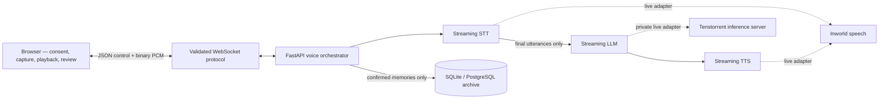

# Linger

> **AI does not create conversations. It catches conversations that almost happened.**

Linger is a realtime oral-history companion for older adults and their families. It listens only after explicit consent, asks one gentle follow-up at a time, and turns approved memories into a private family archive, timeline, family tree, and prompts for the next conversation.

The hackathon demo is deterministic, credential-free, and works without microphone permission. You can run the complete story locally in about three minutes.

## Run the demo

### Prerequisites

- Node.js 22+ and npm 10+
- Python 3.12
- [`uv`](https://docs.astral.sh/uv/) 0.8+

### Start locally

```bash
cp .env.example .env
npm install
npm run db:migrate
npm run db:seed
npm run dev
```

Open **[http://localhost:3000/demo](http://localhost:3000/demo)**.

The web app runs on port `3000` and the FastAPI service on port `8080`. Mock mode is enabled by default, so no API keys, microphone, or browser speech synthesis are required. Starting the demo resets its local fixture, making every presentation repeatable.

## Three-minute walkthrough

1. **Begin intentionally.** Show the explicit recording and saving consent, then choose **Start the conversation**.
2. **Capture a memory.** Advance the scripted exchange about Grandma leaving home while her younger brother Ming watches from the station.
3. **Review before saving.** Extract the memory, inspect every person, relationship, place, date, and unresolved question, then explicitly confirm it.
4. **See the archive connect.** Open the saved story, its provenance-backed 1968 timeline event, and Ming's new family-tree relationship.
5. **Begin the next conversation.** Linger generates: “Ask Grandma what happened to her younger brother Ming after she left home.”
6. **Get out of the way.** Start Family Gathering Mode. Linger asks once, becomes quiet, and visibly turns recording off.

For the exact narration and timing, use the [presenter script](docs/presenter-script.md).

## Why Linger

Most family-history tools begin with a blank form or an interview assignment. Linger begins in a moment that is already happening—a rainy day, an old recipe, a familiar song—and helps the family stay with it.

The core loop is:

```text
Memory → Review and consent → Family archive → A better question → New memory
```

Linger is designed around a few non-negotiable choices:

- **No passive listening.** Capture begins only after an intentional action, and its state is always visible.
- **One concrete question at a time.** The assistant follows details the speaker already shared instead of conducting an interrogation.
- **Nothing saved before review.** Extraction is a temporary draft until the speaker confirms it.
- **Private by default.** New stories are private; family sharing is a separate decision.
- **Provenance over invention.** Direct statements, stored family facts, and derived dates remain distinguishable.
- **Quiet is a feature.** Family Gathering Mode introduces one question and then gives the room back to the family.

## What ships

- A deterministic guided demo with a believable six-person family, five existing stories, a partial tree, timeline events, and unresolved questions
- A separate realtime conversation experience with partial/final transcript states, pause, interruption, correction, mute, and end-without-saving controls
- Reviewable memory extraction for stories, people, relationships, places, dates, themes, and questions
- Transactional archive saving with editable story cards, timeline projection, relationship graph, provenance, sensitivity, and permissions
- A personalized Family Gathering prompt followed by explicit quiet mode and recording-off state
- Keyboard-accessible controls, visible focus, reduced-motion support, responsive layouts, and no-microphone fallback

## Architecture



The browser owns consent, capture, ordered playback, review, and accessible controls. The API owns credentials, provider connections, turn orchestration, validation, persistence, safety boundaries, and observability.

Each voice exchange carries a session ID, monotonic turn ID, and sequence number. Interruption cancels generation and synthesis, clears queued audio, advances the turn, and rejects late events. Partial transcripts are display-only; only final utterances can trigger a response.

Read the deeper [architecture notes](docs/architecture.md) and [WebSocket protocol](docs/websocket-protocol.md).

## Tech stack

| Layer | Technology |
| --- | --- |
| Web | Next.js 16, React 19, TypeScript, Tailwind CSS |
| Realtime audio | AudioWorklet, WebSocket control messages, binary PCM frames |
| API | Python 3.12, FastAPI, Pydantic, async orchestration |
| Data | SQLAlchemy, Alembic, SQLite locally, PostgreSQL-compatible production path |
| Speech | Deterministic mock provider; optional Inworld STT and TTS adapters |
| Inference | Deterministic mock provider; optional private Tenstorrent-hosted OpenAI-compatible server |
| Contracts | Shared JSON Schema, TypeScript types, and Pydantic validation |
| Quality | Vitest, Playwright, pytest, Ruff, mypy, ESLint |

## Repository layout

```text
linger/
├── apps/
│   ├── web/                 Next.js UI, browser voice providers, unit and E2E tests
│   └── api/                 FastAPI, orchestration, providers, archive, migrations
├── packages/protocol/       JSON Schema and matching TypeScript protocol types
├── config/prompts/          Oral-history, extraction, and gathering prompts
├── docs/                    Architecture, providers, privacy, operations, demo help
├── scripts/                 Credential-safe live-provider smoke test
├── .env.example             Local defaults and live-provider configuration
├── docker-compose.yml       Web and API containers for the local stack
└── package.json             Workspace commands
```

## Configuration

The default `.env.example` is deliberately safe and local:

```env
VOICE_PROVIDER=mock
LLM_PROVIDER=mock
DEMO_MODE=true
MOCK_AUTH=true
RAW_AUDIO_RETENTION=false
NEXT_PUBLIC_VOICE_PROVIDER=mock
```

Missing live credentials never break the mock demo, and live mode never silently falls back to a different provider.

### Inworld speech

To exercise the server-side Inworld STT/TTS adapters, read [provider notes](docs/provider-notes.md), verify the models and voice available to the account, then configure:

```env
VOICE_PROVIDER=inworld
NEXT_PUBLIC_VOICE_PROVIDER=backend
INWORLD_API_KEY=your-server-side-credential
INWORLD_STT_MODEL=your-verified-stt-model
INWORLD_TTS_MODEL=inworld-tts-2
INWORLD_VOICE_ID=your-verified-voice
```

Never place provider credentials in a `NEXT_PUBLIC_*` variable.

### Tenstorrent inference

The Tenstorrent service is an external, hardware-backed dependency; Docker Compose does not emulate it. Follow the [Tenstorrent setup guide](docs/tenstorrent-setup.md), verify the served model and context limit on the target system, then configure:

```env
LLM_PROVIDER=tenstorrent
NEXT_PUBLIC_VOICE_PROVIDER=backend
TENSTORRENT_BASE_URL=https://private-model-host.example/v1
TENSTORRENT_API_KEY=managed-secret
TENSTORRENT_MODEL=operator-verified-model-id
TENSTORRENT_HEALTH_URL=https://private-model-host.example/health
```

Keep the inference server on a private authenticated network.

## Database

The local default is SQLite:

```env
DATABASE_URL=sqlite+aiosqlite:///./data/linger.db
```

Migrations and seed data are idempotent:

```bash
npm run db:migrate
npm run db:seed
```

For PostgreSQL, provide an async SQLAlchemy URL such as `postgresql+asyncpg://...` and run the same migration command. Do not reuse the demo database or mock authentication for real family data.

## Verification

All default checks run without provider credentials:

```bash
npm run check       # lint + typecheck + protocol, web, and API tests
npm run build       # production builds for protocol and web
npm run test:e2e    # deterministic desktop and mobile browser flows
npm run smoke:live  # non-mutating readiness check for configured live providers
```

Install Playwright's browser once if needed:

```bash
npx playwright install chromium
```

The live smoke test reports each configured subsystem as passed, failed, skipped, or unavailable without printing secrets or changing archive data.

## Docker

```bash
cp .env.example .env
docker compose up --build
```

Compose runs the web and API services and persists the local SQLite database in a named volume. Inworld remains remote and Tenstorrent remains an external inference server.

## Privacy and production readiness

Raw-audio retention is disabled, voice-session transcript state is not persisted by the WebSocket service, and ending a conversation without saving discards the draft. An approved story is saved only after explicit confirmation and defaults to private.

Mock authentication, local SQLite, development CORS, and unencrypted `ws://` are demo settings. Before using real family data, complete the [privacy and security checklist](docs/privacy-security.md), switch to authenticated sessions and PostgreSQL, use managed secrets and HTTPS/WSS, verify deletion/export/sharing behavior for the deployment jurisdiction, and review the [operations guide](docs/operations.md).

## Documentation

- [Presenter script](docs/presenter-script.md) — exact three-minute demo narration
- [Architecture](docs/architecture.md) — runtime boundaries and invariants
- [WebSocket protocol](docs/websocket-protocol.md) — events, binary audio, ordering, and cancellation
- [Provider notes](docs/provider-notes.md) — verified live APIs and configuration status
- [Tenstorrent setup](docs/tenstorrent-setup.md) — private inference-server requirements
- [Privacy and security](docs/privacy-security.md) — consent, retention, and production checklist
- [Troubleshooting](docs/troubleshooting.md) — common local and live-provider failures
- [Operations](docs/operations.md) — deployment and handoff notes

---

**Memory becomes archive. Archive begins a family conversation. That conversation can become a new memory.**
