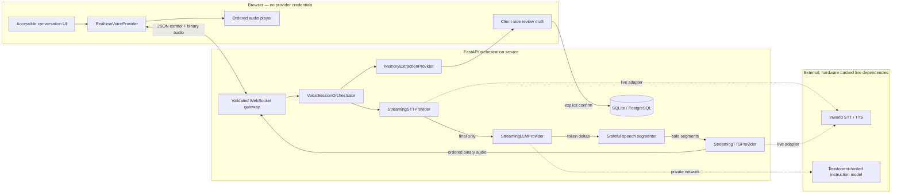

# Linger architecture

Linger is deliberately split at the browser/backend boundary. The web app owns consent, capture, ordered playback, accessible session controls, and presentation. The API owns credentials, provider connections, orchestration, archive persistence, safety validation, and observability.

## Runtime invariants

- Every session uses a UUID `session_id`; each exchange uses a monotonically increasing `turn_id`.
- Ordered streams include sequence numbers. A callback emits only while both its session and turn still match the active turn.
- Partial STT text is display-only. Only final utterances enter the LLM. Speculative generation is disabled unless explicitly enabled.
- Provider queues are bounded. Producers block or reject safely rather than allowing unbounded memory growth.
- The orchestrator is the only component allowed to coordinate providers. Providers never call each other.
- Interrupt cancels generation and synthesis, clears unsynthesized text and unplayed audio, records delivered/uncertain content, increments the turn, and rejects late events.
- Text generation is useful without TTS. A TTS failure leaves the assistant text visible and reports a recoverable warning.
- Extraction happens without database persistence. The browser keeps the review draft on the open page; only explicit confirmation sends the transcript and corrected memory into one archive transaction.

## Mock and live topology

`VOICE_PROVIDER=mock` and `LLM_PROVIDER=mock` are the safe defaults. The browser mock makes `/demo` deterministic even when microphone permission, speech synthesis, the API, or the network is unavailable. The backend mock uses the same normalized provider protocols for integration tests.

Live mode is an operator choice: `VOICE_PROVIDER=inworld` and `LLM_PROVIDER=tenstorrent`. Readiness fails closed if required configuration or verified capabilities are absent. There is no cloud fallback and the Tenstorrent endpoint is never sent to the browser.

## Data boundaries

Raw audio retention is off by default. In the default demo, scripted audio is never captured and archive data is local fixture data. In live sessions, control metadata and audio frames cross the WebSocket only after consent. Credentials stay in the API process. Sensitive transcript content is excluded from production metrics and structured logs.
