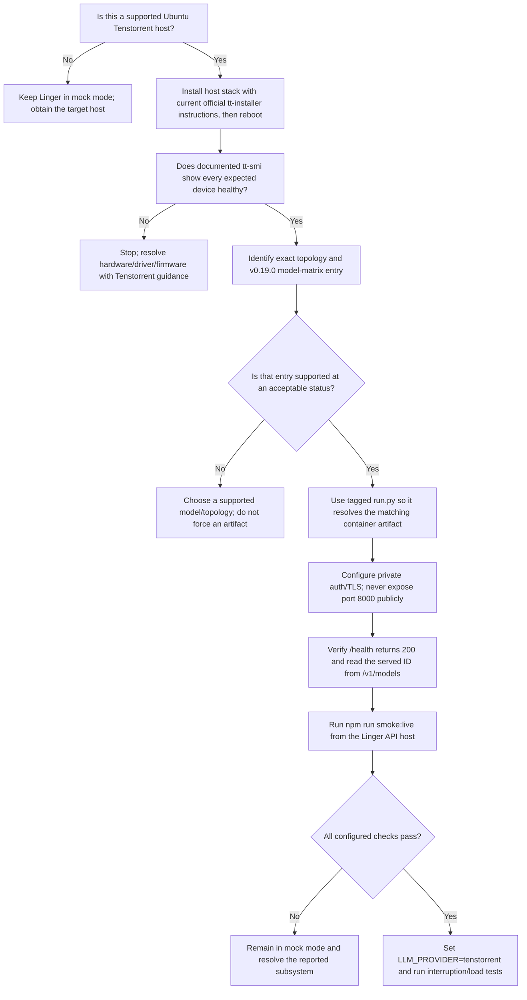

# Tenstorrent setup decision tree

Linger treats Tenstorrent inference as an external hardware-backed dependency. The ordinary Docker Compose file does not emulate a device, install drivers, or publish a model server.

Official sources (accessed 2026-08-01): [host installation](https://docs.tenstorrent.com/getting-started/README.html), [vLLM server deployment](https://docs.tenstorrent.com/getting-started/vLLM-servers.html), [inference-server v0.19.0](https://github.com/tenstorrent/tt-inference-server/releases/tag/v0.19.0), [model matrix](https://github.com/tenstorrent/tt-inference-server/blob/v0.19.0/release_model_spec.json).

## Information the operator must provide

Before enabling live mode, record:

1. Hardware product and topology: N150, N300, P100, P150, multi-card P-series, T3K, QuietBox, LoudBox, Galaxy, or another precisely identified configuration.
2. Supported Ubuntu version, firmware, kernel-mode driver, Metalium/runtime, `tt-smi`, Docker, and hugepage configuration.
3. `tt-inference-server` repository tag and the exact device/model status entry in that release.
4. The model ID returned by `/v1/models`, context limit, quantization/artifact chosen by the tagged launcher, and warm-up behavior.
5. Private host/base URL, health URL, Bearer/JWT configuration, TLS-terminating proxy, network allow-list, and responsible operator.

## Decision tree



## Host and serving guidance

The current documentation recommends Ubuntu 22.04 LTS. Install the host stack through the official `tt-installer` path and reboot. Confirm devices with the documented `tt-smi`; for QuietBox/LoudBox multi-device systems, the deployment guide additionally uses `tt-topology -l mesh` to verify mesh configuration.

The inference-server container needs the expected `/dev/tenstorrent` devices and hugepages. Follow the tagged launcher for the chosen matrix entry rather than copying a command from another card/model. This repository intentionally does not include invented deployment flags or health commands.

## Application configuration

After the server is verified from the API host:

```env
LLM_PROVIDER=tenstorrent
TENSTORRENT_BASE_URL=https://private-model-host.example/v1
TENSTORRENT_API_KEY=<managed bearer secret>
TENSTORRENT_MODEL=<exact /v1/models id>
TENSTORRENT_HEALTH_URL=https://private-model-host.example/health
TENSTORRENT_MAX_CONTEXT_TOKENS=<verified server/model limit>
```

The API performs an HTTP-200 health check, attempts model discovery where supported, and rejects a configured model absent from the returned list. It preserves bounded recent context, uses deterministic truncation, and never falls back to an external cloud model.

## Production network boundary

- Bind the inference server to a private interface or firewall it to the Linger API host.
- Put TLS and strong authentication at a trusted reverse proxy if the serving process does not terminate TLS.
- Do not publish port 8000 through the public application ingress.
- Rotate bearer/JWT material; never use documentation examples such as `testing`.
- Log health, queue and latency metadata without prompts, transcript content, tokens, or secrets.
- Validate task cancellation, connection loss, warm-up, concurrency, context overflow, and model reload on the actual deployment before collecting family stories.

